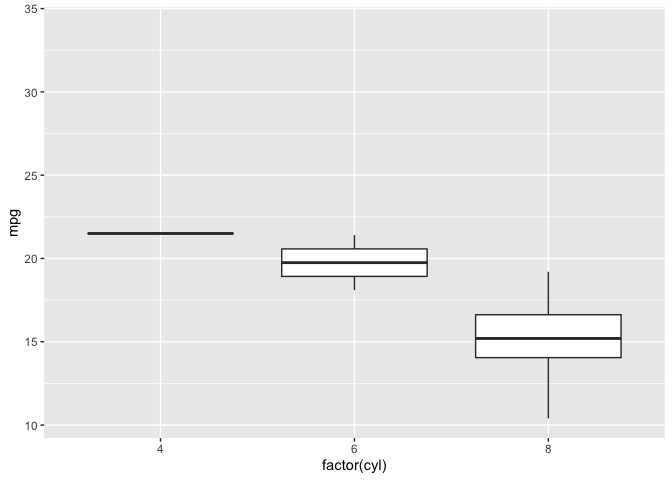

ease\_aes - a walkthrough
================
Sarah Romanes
22 November 2018

# What does `ease_aes()` do?

> ease\_aes() defines how different aesthetics should be eased during
> transitions.

I like to think of ease describing the *acceleration* of our transition.
Should it have a constant speed? Should it speed up or slow down? Or
should it bounce around? We can control this using this component of
`gganimate`.

There are **two** components to the `ease_aes` function, which are drawn
from the `tweenr` package. They are:

  - The name of the easing function to display: `ease`
  - And the modifier for said `ease` function, in the form of `-in`,
    `-out`, or `-in-out`.

Each `ease_aes()` command requires the ease function AND the modifier,
*except* for the special case of the `linear function`.

## The `ease` function

The ease function controls the *shape* of the acceleration. For example,
`linear` will produce a constant speed for the transition, whereas
`bounce` will provide a bouncing effect\!

A list of the easing functions can be found
[here](https://www.rdocumentation.org/packages/tweenr/versions/0.1.5/topics/display_ease),
and they can easily be visualised with the use of the `tweenr` package
as follows:

``` r
par(mfrow=c(1,2))
tweenr::display_ease('linear')
tweenr::display_ease('bounce-in')
```

<!-- -->

**Constant rate of change**

``` r
ggplot(mtcars, aes(factor(cyl), mpg)) + 
  geom_boxplot() + 
  transition_states(
    gear,
    transition_length = 3,
    state_length = 1
  ) +
  enter_fade() + 
  exit_shrink() +
  ease_aes('linear')
```

<!-- -->

**Bouncing**

``` r
ggplot(mtcars, aes(factor(cyl), mpg)) + 
  geom_boxplot() + 
  transition_states(
    gear,
    transition_length = 3,
    state_length = 1
  ) +
  enter_fade() + 
  exit_shrink() +
  ease_aes('bounce-out')
```

<!-- -->

# The affect of the modifiers

## Motivation

For the `linear` ease function, it is clear the rate of change is
constant - so there is only one possible linear combination:

``` r
tweenr::display_ease('linear')
```

<!-- -->

However, for the `quadratic` function, we have two options:

``` r
par(mfrow=c(1,2))
tweenr::display_ease('quadratic-in')
tweenr::display_ease('quadratic-out')
```

<!-- -->

It is clear that the role of the `-in` and `-out` modifiers is to change
which *reflection* on the line *y=x* our function is on. This has the
affect of changing concavity, or more pratically, the type of
acceleration. In the `quadratic-in` example, our transition state is
*speeding up* as time progresses. However, in `quadratic-out`, our
transition state is *slowing down* as time progresses.

**Speeding up**

``` r
ggplot(mtcars, aes(factor(cyl), mpg)) + 
  geom_boxplot() + 
  transition_states(
    gear,
    transition_length = 3,
    state_length = 1
  ) +
  enter_fade() + 
  exit_shrink() +
  ease_aes('quadratic-in')
```

<!-- -->

**Slowing down**

``` r
ggplot(mtcars, aes(factor(cyl), mpg)) + 
  geom_boxplot() + 
  transition_states(
    gear,
    transition_length = 3,
    state_length = 1
  ) +
  enter_fade() + 
  exit_shrink() +
  ease_aes('quadratic-out')
```

<!-- -->

### The `-in-out` modifier

The `in-out` modifier essentially appends the two accelerations
together, speeding up and then slowing down. We can visualise this with
the quadratic function as follows:

``` r
tweenr::display_ease('quadratic-in-out')
```

<!-- -->

``` r
ggplot(mtcars, aes(factor(cyl), mpg)) + 
  geom_boxplot() + 
  transition_states(
    gear,
    transition_length = 3,
    state_length = 1
  ) +
  enter_fade() + 
  exit_shrink() +
  ease_aes('quadratic-in-out')
```

<!-- -->

# A more interesting example

We can use the `ggimage` package to add in the image of a car and
visualise it transitioning from state (one side of the screen to the
other) and changing the way it gets there using `ease_aes()`.

We first set up our static background:

``` r
library(ggimage)

ggdat <- expand.grid(x=0.75 * c(0:14),
                     y=3* c(0:10),
                     fill=NA)


fill <- rep(NA, nrow(ggdat))

for(i in 1:nrow(ggdat)){
  if(ggdat$y[i]<=12){
    fill[i] <- "#009900"
  }
  else if(ggdat$y[i]==15){
    fill[i] <- "#72777f"
  } else
  {fill[i] <- "#4e86e0"}
}

ggdat$fill <- fill

ga <- ggplot(ggdat, aes(x, y)) +
  geom_tile(aes(fill=I(fill)), height=6, width=0.75, colour="white", size=1.2) +theme_void()
ga
```

<!-- -->

And now we add a `bounce` function with `-in-out` modifier - creating
the feeling of struggling to parallel park\!

``` r
dta <- data.frame(y =     c(15, 15),
                  x =     c(0,  10.5),
                  tstep = c("a" , "b"),
                  image = rep("images/car.png",2))


ga1 <- ga +geom_image(data=dta, aes(x,y, image=image), size=0.2)
```

    ## Warning: Ignoring unknown parameters: image_colour

``` r
ga1 + transition_states(tstep,
                     transition_length=1,
                     state_length = 1) +
  ease_aes('bounce-in-out')
```

<!-- -->
