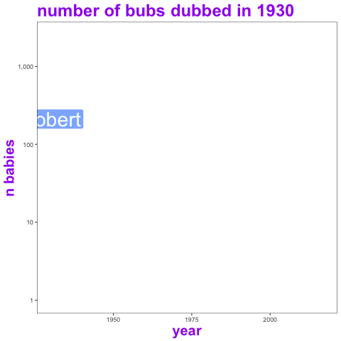
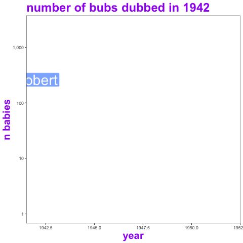
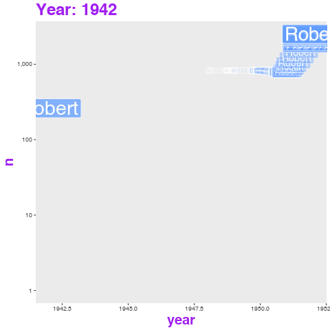

enter\_exit
================
Robbie Bonelli
22/11/2018

What does `transition_time()` do?
=================================

> The purpose of enter\_*() and exit\_*() is to control what happens with data that does not persist during a tween.

In simple words it controls how data that either appear and or disapper in the plot because of the animation will enter or exit the plot.

To understand better:

Create fake data
----------------

``` r
dat <- data.frame(id=c(rep("robbie",4),rep("saskia",5),rep("anna",7)),time=c(1:4,2:6,4:10))
dat$money <- rnorm(nrow(dat))*dat$time

ggplot(dat)+geom_line(aes(x=time,y=money,group=id,color=id),size=2)
```


This dataset contains time data for three people and how much money they have. Note that each person enters the total time frame for a limited amount of time. This means that if we animate around time, some people should disappers and appers depending on the time point we are visualising.

These parameters let you control that!

Simple sudden apper
===================

``` r
p <- ggplot(dat, aes(x=time,group=id))+ geom_label(aes(y=money,label=id,color=id),size=10) +  transition_time(time=time)+enter_appear()+exit_disappear()
animate(p)
```


Growing and Shrinking
---------------------

``` r
p <- ggplot(dat, aes(x=time,group=id))+ geom_label(aes(y=money,label=id,color=id),size=10) +  transition_time(time=time)+enter_grow()+exit_shrink()
animate(p)
```


Fading
------

``` r
p <- ggplot(dat, aes(x=time,group=id))+ geom_label(aes(y=money,label=id,color=id),size=10) +  transition_time(time=time)+enter_fade()+exit_fade()
animate(p)
```


Enter or Exit need the grouping factor!
=======================================

Let's try to take off the grouping

``` r
p <- ggplot(dat, aes(x=time))+ geom_label(aes(y=money,label=id),size=10) +  transition_time(time=time)+enter_appear()+exit_disappear()
animate(p)
```


As we see this not work properly!

oz baby names
=============

Use the oz baby names backage to show how a selection of names have varied in popularity in Australia over time.

This animation uses `geom_line()` and `geom_label()` with a `transition_reveal()` and `enter_grow()` and `exit_shrink()`.

For these line chart reveal animations it's important in the `ggplot` portion of code to set the `group` aesthetic equal to the variable you are interested in tracing (it may help to think of it as the variable you would facet over in a static plot). This `id` argument of the `transition_reveal` function should also be set to this same variable.

``` r
install_github("ropenscilabs/ozbabynames")
```

``` r
library(ozbabynames)
```

`enter_*` or `exit_*` need a **small range of the along parameter** to be perceived otherwise it will look like they are not working. Also it needs `transition_time()` not `transition_reveal()`... no idea why...
-------------------------------------------------------------------------------------------------------------------------------------------------------------------------------------------------------------------

``` r
author_names <- c("Robin", "Robert", "Mitchell", "Nicholas", "Jessie", "Jessica")

dat <- ozbabynames %>%
  filter(name %in% author_names) %>%
  count(name,year, wt = count) 


p1 <-   ggplot(aes(x = year, 
             y = n,
             colour = name,
             group = name,
             label = name,
             fill = name),data=dat) +
  geom_line(size = 1, linetype = "dotted") +
  geom_label(colour = "white", alpha = 0.75, size =  10) +
  theme_bw() +
  theme(panel.grid = element_blank(),
        legend.position = "none",
        title = element_text(colour = "purple",
                             size = 20,
                             face = "bold")
        ) +
  labs( title = "number of bubs dubbed in {frame_along} ",y = "n babies" ) +
  scale_y_log10(labels = scales::comma) 

  
  
p <- p1+  transition_reveal(id = name, along = year) + enter_grow() + exit_shrink()


animate(p,nframes = 50)
```



Reduce the range of the **along** parameter (year) and use `transition_time()`.
-------------------------------------------------------------------------------

``` r
dat <- ozbabynames %>%
  filter(name %in% author_names) %>%
  count(name,year, wt = count)

dat1 <- dat[dat$year%in%c(1942:1952),]


p1 <-   ggplot(aes(x = year, 
             y = n,
             group = name,
             label = name,
             fill = name),data=dat1) +
#  geom_line(aes(colour = name),size = 1, linetype = "dotted") +
  geom_label(colour = "white", alpha = 0.75, size =  10) +
  theme_bw() +
  theme(panel.grid = element_blank(),
        legend.position = "none",
        title = element_text(colour = "purple",
                             size = 20,
                             face = "bold")
        ) +
# labs( title = "number of bubs dubbed in {frame_along} ",y = "n babies" ) +
  labs( title = "number of bubs dubbed in {frame_time} ",y = "n babies" ) +
  scale_y_log10(labels = scales::comma) 


#p <- p1+  transition_reveal(id = name, along = year,keep_last = F) + enter_grow() 
p <- p1+  transition_time(time = year) + enter_grow() + exit_shrink()


animate(p)
```



``` r
p1=ggplot(dat1,aes(x=year,y=n,colour=name,fill = name)) + 
  geom_point() +
  transition_reveal(id=name,along=year)+
  shadow_trail(distance = 0.01, size = 2)+
  theme(panel.grid = element_blank(),
        legend.position = "none",
        title = element_text(colour = "purple",
                             size = 20,
                             face = "bold")
        )+
  ease_aes('bounce-out')+
  geom_label(aes(label=name),colour = "white", alpha = 0.75, size =  10) +
  scale_y_log10(labels = scales::comma) +
  shadow_wake(wake_length = .4)+
  labs(title="Year: {frame_along}")
animate(p1,detail = 5, type = "cairo",nframes = 50)
```


