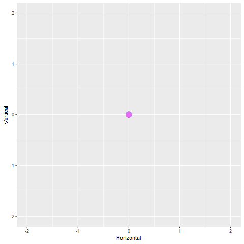

shadow\_trail
================
Danielle Navarro
26/11/2018

This `shadow_trail()` walk through extends the `shadow_wake()` walk through and uses the same animation.

``` r
ntimes <- 20  # how many time points to run the bridge?
nseries <- 5 # how many time series to generate?

# function to generate the brownian bridges
make_bridges <- function(ntimes, nseries) {
  replicate(nseries, c(0,rbridge(frequency = ntimes-1))) %>% as.vector()
}

# construct tibble
tbl <- tibble(
  Time = rep(1:ntimes, nseries),
  Horizontal = make_bridges(ntimes, nseries),
  Vertical = make_bridges(ntimes, nseries),
  Series = gl(nseries, ntimes)
)

# construct the base picture
base_pic <- tbl %>%
  ggplot(aes(
    x = Horizontal, 
    y = Vertical, 
    colour = Series)) + 
  geom_point(
    show.legend = FALSE,
    size = 5) + 
  coord_equal() + 
  xlim(-2,2) + 
  ylim(-2,2)

# base animation with no shadow
base_anim <- base_pic + transition_time(time = Time) 
base_anim %>% animate(type = "cairo")
```


See the other walk through for details.

### Basic use

``` r
trail1 <- base_anim + 
  shadow_trail()
trail1 %>% animate(type = "cairo")
```



To make it a little easier to visualise, let's modify the size and transparency of the trail markers:

``` r
trail2 <- base_anim + 
  shadow_trail(size = 2, alpha = .2)
trail2 %>% animate(type = "cairo")
```


### Changing the distance

Whereas `shadow_mark()` shows the raw data in each frame in the data (i.e., does not consider interpolated frames, `shadow_trail()` does not privilege those frames that correspond to your data, and instead leaves the trail behind for interpolated frames as well. To show more trail markers, decrease the `distance`:

``` r
trail3 <- base_anim + 
  shadow_trail(distance = 0.01, size = 2, alpha = .2)
trail3 %>% animate(type = "cairo")
```


### Changing the number of frames

By default the trail shows all previous trail markers ("crumbs"). You can modify this so that only a fixed number of trail markers are displayed, which makes `shadow_trail()` behave a little more like `shadow_wake()` than `shadow_mark()`:

``` r
trail4 <- base_anim + 
  shadow_trail(distance = 0.01, max_frames = 25, size = 2, alpha = .2)
trail4 %>% animate(type = "cairo")
```


