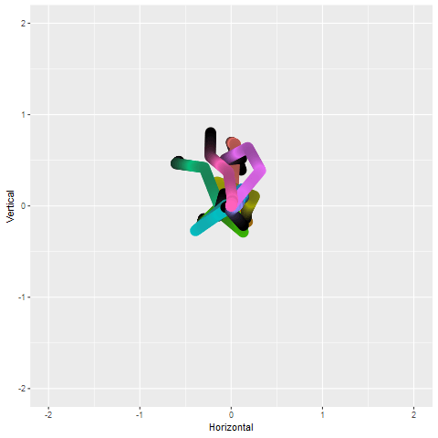
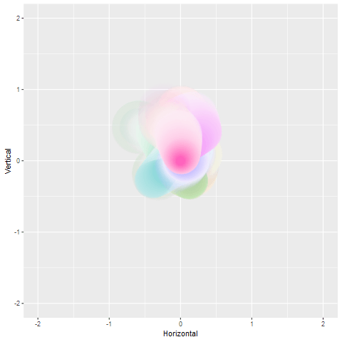

shadow\_wake
================
Danielle Navarro
22/11/2018

Create a two dimensional brownian bridge simulation

``` r
ntimes <- 20  # how many time points to run the bridge?
nseries <- 10 # how many time series to generate?

# function to generate the brownian bridges
make_bridges <- function(ntimes, nseries) {
  replicate(nseries, c(0,rbridge(frequency = ntimes-1))) %>% as.vector()
}

# construct tibble
tbl <- tibble(
  Time = rep(1:ntimes, nseries),
  Horizontal = make_bridges(ntimes, nseries),
  Vertical = make_bridges(ntimes, nseries),
  Series = gl(nseries, ntimes)
)

glimpse(tbl)
```

    ## Observations: 200
    ## Variables: 4
    ## $ Time       <int> 1, 2, 3, 4, 5, 6, 7, 8, 9, 10, 11, 12, 13, 14, 15, ...
    ## $ Horizontal <dbl> 0.000000000, -0.049879825, 0.415680479, 0.537517639...
    ## $ Vertical   <dbl> 0.00000000, -0.15372441, -0.30528943, -0.52619625, ...
    ## $ Series     <fct> 1, 1, 1, 1, 1, 1, 1, 1, 1, 1, 1, 1, 1, 1, 1, 1, 1, ...

Draw a picture so that you can see what each of the frames looks like:

``` r
base_pic <- tbl %>%
  ggplot(aes(
    x = Horizontal, 
    y = Vertical, 
    colour = Series,
    fill = Series)) + 
  geom_point(
    show.legend = FALSE,
    size = 5) + 
  coord_equal() + 
  xlim(-2, 2) + 
  ylim(-2, 2)

base_pic + facet_wrap(~Time)
```


Make the base animation using `transition_time()`

``` r
base_anim <- base_pic + transition_time(time = Time) 
base_anim %>% animate()
```


Now add some `shadow_wake()` because shadow wake is cool

``` r
wake1 <- base_anim + shadow_wake(wake_length = .1)
wake1 %>% animate()
```


Yay!

The discrete look is a bit meh. If we want it to look like a continuous thing we can up the detail on the call to `animate()`.

``` r
wake1 %>% animate(detail = 5)
```


This still looks janky. When I rendered this on Adam Gruer's Mac it worked beautifully, but I'm rendering this on a Windows machine and it looks garbage. To fix this we need to tinker with the rendering. Under the hood, each frame is being rendered with the `png()` graphics device and by default it's using the Windows GDI. Let's use Cairo:

``` r
wake1 %>% animate(detail = 5, type = "cairo")
```


Changing the length of the tail by changing `wake_length`. To make it 20% of the total animation

``` r
wake2 <- base_anim + shadow_wake(wake_length = .2)
wake2 %>% animate(detail = 5, type = "cairo")
```


At the moment the transparency of the trail is falling off as well as the size. So let's tell it to leave the size untouched and have the wake change only in transparency

``` r
wake3 <- base_anim + shadow_wake(wake_length = .1, size = NULL)
wake3 %>% animate(detail = 5, type = "cairo")
```


Similarly we can turn off the transparency

``` r
wake4 <- base_anim + shadow_wake(wake_length = .1, size = NULL, alpha = NULL)
wake4 %>% animate(detail = 5, type = "cairo")
```


We can set it so that the `colour` and `fill` end up at a certain value. For example, to have the trails fade to black:

``` r
wake5 <- base_anim + 
  shadow_wake(wake_length = .1, 
              size = NULL, 
              alpha = NULL,
              colour = "black",
              fill = "black"
              )
wake5 %>% animate(detail = 5, type = "cairo")
```


At the moment the colour isn't changing linearly. We can do that by changing the `falloff` argument. By default it uses a the "cubic-in" easing function, but we can make it "linear":

``` r
wake6 <- base_anim + 
  shadow_wake(wake_length = .1, 
              size = NULL, 
              alpha = NULL,
              colour = "black",
              fill = "black",
              falloff = "linear"
              )
wake6 %>% animate(detail = 5, type = "cairo")
```


Changing the easing function on the falloff can produce suprising variations. This is "bounce-out"

``` r
wake7 <- base_anim + 
  shadow_wake(wake_length = .1, 
              size = NULL, 
              alpha = NULL,
              colour = "black",
              fill = "black",
              falloff = "bounce-out"
              )
wake7 %>% animate(detail = 5, type = "cairo")
```



Playing with the combinations produces other variations,

``` r
wake8 <- base_anim + 
  shadow_wake(wake_length = .3, 
              size = 15, 
              fill = "white",
              falloff = "quintic-in"
              )
wake8 %>% animate(detail = 5, type = "cairo")
```



The other arguments to the function allow flexiblity in other ways. In this simulation it makes sense to "wrap" the shadow wake (i.e., allow shadows from the end of the animation to appear at the beginning) because the time series' are all designed to be cyclic: they end at the same state that they started. Sometimes that's undesirable (wrapping a shadow from 1977 onto a data point from 2018 is a bit weird since time is thankfully not a loop), so you can turn this off by setting `wrap = FALSE`:

``` r
wake9 <- base_anim + 
  shadow_wake(wake_length = .3, 
              size = 15, 
              fill = "white",
              falloff = "quintic-in",
              wrap = FALSE
              )
wake9 %>% animate(detail = 5, type = "cairo")
```


