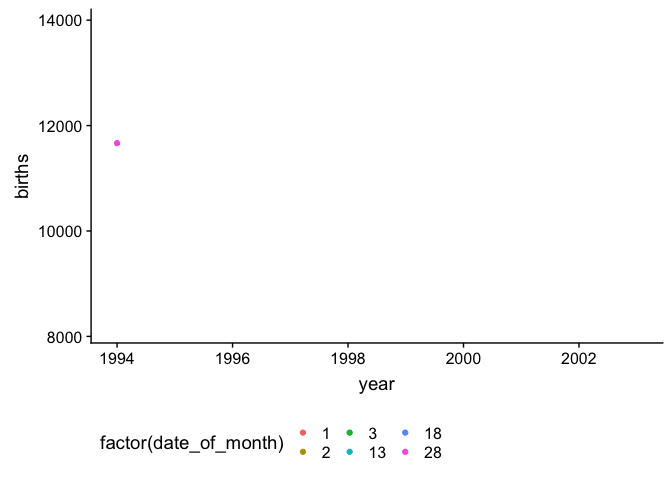

transition\_components
================
Anna Quaglieri
22/11/2018

-   [How does `transition_components()` work?](#how-does-transition_components-work)
-   [A minimal example](#a-minimal-example)
-   [US births 1994-2003](#us-births-1994-2003)
-   [Example with babynames](#example-with-babynames)

``` r
devtools::install_github("hadley/emo")
devtools::install_github("ropenscilabs/icon")
```

``` r
library(gganimate)
library(tidyverse)
library(fivethirtyeight)
```

How does `transition_components()` work?
----------------------------------------

> Transition individual components through their own lifecycle
> ------------------------------------------------------------
>
> This transition allows individual visual components to define their own "life-cycle". This means that the final animation will not have any common "state" and "transition" phase as any component can be moving or static at any point in time.

> Usage
> -----
>
> transition\_components(time, range = NULL, enter\_length = NULL, exit\_length = NULL)

Some key points to keep in mind:

In `transition_components()` you need at least a **time** component and a variable id in your dataset that groups together observations. The `transition_components()` function is useful when you have the same identifier (like a plane, a day, a person, a neighborood etc.) with multiple observations over time.

A minimal example
-----------------

The example below is the one provided in the help page `?transition_components` and I added a few simple variants.

-   In the standard situation you would use the `group` argument in the `ggplot()` call to define which are the observations with the same IDs.

``` r
data <- data.frame(
  x = runif(10),
  y = runif(10),
  size = sample(1:3, 10, TRUE),
  time = c(1, 4, 6, 7, 9, 6, 7, 8, 9, 10),
  id = rep(1:2, each = 5)
)

anim <- ggplot(data, aes(x, y, size = size, group = id)) +
  geom_point() +
  transition_components(time)
```

-   You can also achieve the same transition but with different colours per ID by using the `colour` argument, which is a more special way of grouping observations.

``` r
anim <- ggplot(data, aes(x, y, size = size,colour=as.factor(id))) +
  geom_point() +
  transition_components(time)
```

-   Notice what happens if you do not set any of the above (`group` or `colour`). You can see that the transition lost the knowledge about what observations belong to the same ID.

``` r
anim <- ggplot(data, aes(x, y, size = size)) +
  geom_point() +
  transition_components(time)
```

US births 1994-2003
-------------------

To show another example, I will use the `US_births_1994_2003` dataset from the `fivethirtyeight` package. The title of the article where this data was used is *Some People Are Too Superstitious To Have A Baby On Friday The 13th*. Is that true?

``` r
head(US_births_1994_2003)
```

    ## # A tibble: 6 x 6
    ##    year month date_of_month date       day_of_week births
    ##   <int> <int>         <int> <date>     <ord>        <int>
    ## 1  1994     1             1 1994-01-01 Sat           8096
    ## 2  1994     1             2 1994-01-02 Sun           7772
    ## 3  1994     1             3 1994-01-03 Mon          10142
    ## 4  1994     1             4 1994-01-04 Tues         11248
    ## 5  1994     1             5 1994-01-05 Wed          11053
    ## 6  1994     1             6 1994-01-06 Thurs        11406

In the example below my **grouping variable** will be Fridays of the month, stored into the variable `date_of_month` after I only filter for Fridays. For example, one id is **1**, which is the 1st Friday of a generic month across years. My plan is to compare the number of babies born on the Fridays 13th of different months (**13**) with babies born on other Fridays! To speed up the process I will compare Fridays 13th with Fridays that occurs on the 1st, 2nd, 3rd, 18th and 28th across months and years.

``` r
# Select only Fridays
fridays <- US_births_1994_2003 %>% 
  filter(day_of_week %in% c("Fri") & date_of_month %in% c(1,2,3,13,18,28))

head(fridays)
```

    ## # A tibble: 6 x 6
    ##    year month date_of_month date       day_of_week births
    ##   <int> <int>         <int> <date>     <ord>        <int>
    ## 1  1994     1            28 1994-01-28 Fri          11666
    ## 2  1994     2            18 1994-02-18 Fri          11887
    ## 3  1994     3            18 1994-03-18 Fri          11799
    ## 4  1994     4             1 1994-04-01 Fri          10630
    ## 5  1994     5            13 1994-05-13 Fri          11085
    ## 6  1994     6             3 1994-06-03 Fri          11799

-   Grouping using colouring allows me to compare different dates of Fridays

``` r
p=ggplot(fridays) + 
  geom_point(aes(x=year,y=births,colour=factor(date_of_month))) +
  theme(legend.position = "bottom") +
  transition_components(time=date)+
  shadow_trail(distance = 0.01, size = 0.3)

animate(p, nframes = 20, 10,duration=10)
```



It looks like between 1994 and 1995 there were consistently less babies born on Fridays 13th, but then this fashion went away. Was that just by chance?!

Example with babynames
----------------------

The `babynames` packages is one of the great packages developed thanks to the effort of another \#OzUnconf18 team <https://github.com/ropenscilabs/ozbabynames>!

Below I am showing another example that uses `transition_components()` in combination with other fun animations like:

-   `shadow_trail()` which allows you to customise the way in which your observations leave a trace of themselves once they move on with their transitions.

-   Within `shadow_trail()`, the argument `distance` lets you specify the distance between each trace left. I noticed that it does not work with a very small distance (0.001 wasn't working). It has something to do with the fact that `distance` is used as a denominator at some steps and probably it gets too small.
-   The argument `size` works like in the normal `ggplot()` (e.g. size of dots) and it specifies the size of trace left.

``` r
# install_github("ropenscilabs/ozbabynames")
library(ozbabynames)

p=ggplot(ozbabynames[ozbabynames$name %in% c("Michael","James"),]) + 
  geom_point(aes(x=year,y=count,colour=name)) +
  theme_bw() + 
  transition_components(time=year)+
  shadow_trail(distance = 0.1, size = 2)
p
```


-   Let's increase the `distance`

``` r
p=ggplot(ozbabynames[ozbabynames$name %in% c("Michael","James"),]) + 
  geom_point(aes(x=year,y=count,colour=name)) +
  transition_components(time=year)+
  shadow_trail(distance = 2, size = 2)
p
```


-   `distance` too small. The code below will throw the error:

> Error in seq.default(1, params*n**f**r**a**m**e**s*, *b**y* = *p**a**r**a**m**s*distance) : invalid '(to - from)/by'

``` r
p=ggplot(ozbabynames[ozbabynames$name %in% c("Michael","James"),]) + 
  geom_point(aes(x=year,y=count,colour=name)) +
  transition_components(time=year)+
  shadow_trail(distance = 0.001, size = 2)

p
```
