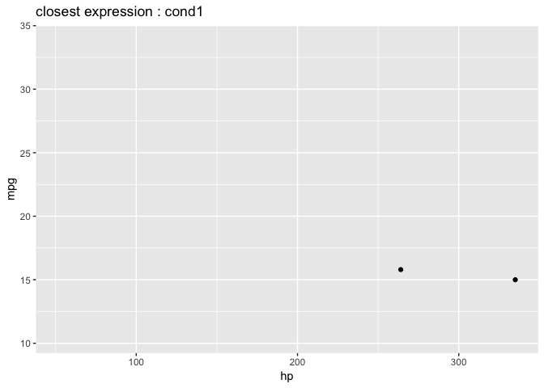

transition\_filter
================
Anna Quaglieri
22/11/2018

-   [`transition_components`](#transition_components)
    -   [How do the filtering actually works?](#how-do-the-filtering-actually-works)
    -   [Let's investigate the `keep` argument.](#lets-investigate-the-keep-argument.)
-   [Errors encountered along the way](#errors-encountered-along-the-way)
-   [Suggestion for improvement](#suggestion-for-improvement)
-   [Halloween Candy data!](#halloween-candy-data)

``` r
devtools::install_github("thomasp85/gganimate")
devtools::install_github("thomasp85/transformr")
```

``` r
library(tidyverse)
```

    ## ── Attaching packages ────────────────────────────────────── tidyverse 1.2.1 ──

    ## ✔ ggplot2 3.1.0     ✔ purrr   0.2.5
    ## ✔ tibble  1.4.2     ✔ dplyr   0.7.7
    ## ✔ tidyr   0.8.2     ✔ stringr 1.3.1
    ## ✔ readr   1.1.1     ✔ forcats 0.3.0

    ## ── Conflicts ───────────────────────────────────────── tidyverse_conflicts() ──
    ## ✖ dplyr::filter() masks stats::filter()
    ## ✖ dplyr::lag()    masks stats::lag()

``` r
library(gganimate)
library(transformr)
```

`transition_components`
=======================

Let's start simple!! I believe that's where all big things start...

-   `ggplot() + geom_point()`

``` r
mydf <- mtcars
p1=ggplot(mydf, aes(x = hp, y = mpg)) +
geom_point()
p1
```


Let's add `transition_filter()`

``` r
p1 + transition_filter(transition_length = 10, 
                       filter_length = 0.2, 
                       wrap = TRUE, 
                       keep = FALSE,
                       qsec < 15,  qsec > 16) +
  labs(title="{closest_expression}")
```


How do the filtering actually works?
------------------------------------

`transition_filter` requires at least two logical conditions that it will use to produce the different instances of the animation. For example, in the example below `transition_filter` will plot first `hp` vs `mpg` only for rows that satisfies `qsec < 15` and then will plot `hp` vs `mpg` only for rows that satisfies `qsec > 16`. You can add as many conditions as you like!

Below I ran `transition_filter` with three filters and added `Label variables` to the title to give an idea what filters are used at each state.

``` r
p1 + transition_filter(transition_length = 10, 
                       filter_length = 0.2, 
                       wrap = TRUE, 
                       keep = FALSE,
                       qsec < 14,  qsec > 16, qsec > 20) + 
  labs(title = "closest expression : {closest_expression}, \n transitioning : {transitioning}, \n closest_filter : {closest_filter}")
```


You can also provide a `TRUE\FALSE` column from your data frame as the logical condition!!!

``` r
mydf <- mydf %>% mutate(cond1 = qsec < 15,
                        cond2 = qsec > 15 & qsec < 20,
                        cond3 = qsec > 20)

# update ggplot plo
p1=ggplot(mydf, aes(x = hp, y = mpg)) +
geom_point()

head(mydf[,c("cond1","cond2","cond3")])
```

    ##   cond1 cond2 cond3
    ## 1 FALSE  TRUE FALSE
    ## 2 FALSE  TRUE FALSE
    ## 3 FALSE  TRUE FALSE
    ## 4 FALSE  TRUE FALSE
    ## 5 FALSE  TRUE FALSE
    ## 6 FALSE FALSE  TRUE

``` r
p1 + transition_filter(transition_length = 10, 
                       filter_length = 0.2, 
                       wrap = TRUE, 
                       keep = FALSE,
                       cond1,cond2) + 
  labs(title = "closest expression : {closest_expression}")
```



Let's investigate the `keep` argument.
--------------------------------------

In the previous examples `keep` has always been `FALSE`. To make things a little bit exciting I will set it know to `FALSE`.

``` r
g <- p1 + transition_filter(transition_length = 10, 
                            filter_length = 0.2, 
                            wrap = TRUE, 
                            keep = TRUE,
                            qsec < 14,qsec > 16,qsec > 20) + 
  labs(title = "closest expression : {closest_expression}, \n transitioning : {transitioning}, \n closest_filter : {closest_filter}")

animate(g, nframes = 10, fps = 2)
```


Great! But... now I cannot really see what's being filtered at each stage.

Errors encountered along the way
================================

If you ever get: `Error in transform_path(all_frames, next_filter, ease, params$transition_length[i],transformr is required to tween paths and lines` install the package `transformr`.

Suggestion for improvement
==========================

-   Maybe it would be good to add an option to have different colours for the observations that satisfy the regular expression. Something like a vector of length 1 or the same length as the number of conditions provided.

Halloween Candy data!
=====================

Did you know how many types of Halloween Candies you could get?? I have been trying to understand how the sugar content and the price correlate depending whether is a `chocolate`, `fruity` or `caramel` candy!

Not sure that makes much sense though :/

Probably, we should try to prevent the labels from moving while transitioning, since the dots remains in the same position. I have been trying using the `exclude_layer = 5` inside `transition_filter` that Danielle successfully used in `shadow_wake` <https://github.com/ropenscilabs/learngganimate/blob/master/shadow_wake.md> but it does not like it.

``` r
library(fivethirtyeight)
library(ggrepel)
data(candy_rankings)

p1=ggplot(candy_rankings) + 
  geom_point(aes(x=sugarpercent,y=pricepercent,colour=competitorname))+
  theme_bw()+
  theme(legend.position = "none") +
  geom_text_repel(aes(x=sugarpercent,y=pricepercent,colour=competitorname,label=competitorname)) +
  transition_filter(transition_length = 10, 
                            filter_length = 0.2, 
                            wrap = TRUE, 
                            keep = FALSE,
                    chocolate,fruity,caramel) + 
  labs(title = "closest expression : {closest_expression}")

animate(p1,nframes=50,duration=60)
```


