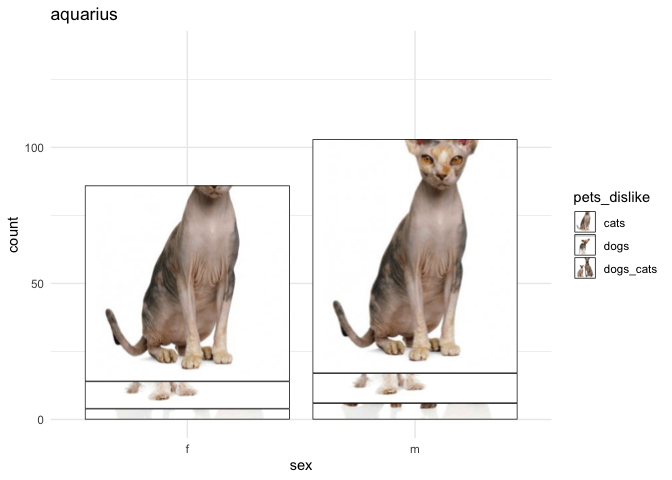

transition\_manual
================
Adam Gruer + Saskia Freytag
22/11/2018

## Explain transition\_manual

A static plot

``` r
cars_plot <- ggplot(mtcars, aes(disp, mpg), ) + 
  geom_point(colour = "purple", size = 3) 
cars_plot
```

<!-- -->

Facet by cylinder

``` r
cars_plot + facet_wrap(~cyl)
```

<!-- -->

\#\#Animate

Transition manual will show one frame per level of the supplied
variable. The `{current_frame}` can be used anywhere that accepts a
string (I think\!) to display the value of the ‘frame’ variable at each
step of the animation.

``` r
cars_plot + transition_manual(cyl) +
  labs(title = "{current_frame}")
```

    ## nframes and fps adjusted to match transition

<!-- -->

## More complex example

In this example we will be using the `okcupiddata` 📦 ❤️ to visualize how
feelings about pets change with star sign, sex and relationship status.
First let’s begin with some data wrangling.

Intitally, we extract the columns we are interested in in the `profiles`
data.

``` r
data(profiles)
profiles_red <- profiles %>% select(pets, sex, status, sign)
```

Unfortunatley, the `sign` column does not simply contain the 12 star
signs, but includes people’s feelings about the importance of star
signs. We will delete these for now. We will then ensure that the sign
column is a factor with ordered levels for the different star
signs.

``` r
profiles_red <- profiles_red %>% mutate(sign = str_extract(sign, "[a-z']+[[:space:]]")) %>% mutate(sign = gsub(" ", "", sign))
profiles_red <- profiles_red %>% 
  mutate(sign = factor(sign, levels=c("aries", "taurus", "gemini", "cancer",
                                      "leo", "virgo", "libra", "scorpio",
                                      "sagittarius", "capricorn", "aquarius",
                                      "pisces"))) 
```

The next step is to entangle the `pets` column, which includes people’s
likes and dislikes of pets as well as their pet ownership. We will
disentangle all of these into three new columns that we will call
`pets_dislike`, `pets_like` and `pets_has`.

``` r
profiles_red <- profiles_red %>% 
  mutate(pets_dislike = case_when(
    str_detect(pets, "dislikes dogs and dislikes cats") ~ "dogs_cats",
    str_detect(pets, "dislikes dogs") ~ "dogs", 
    str_detect(pets, "dislikes cats") ~ "cats"))
profiles_red <- profiles_red %>% mutate(sign = gsub(" ", "", sign))
profiles_red <- profiles_red %>% 
  mutate(pets_like = case_when(
    str_detect(pets, "likes dogs and likes cats") ~ "dogs_cats",
    str_detect(pets, "likes dogs") ~ "dogs", 
    str_detect(pets, "likes cats") ~ "cats"))
profiles_red <- profiles_red %>% 
  mutate(pets_has = case_when(
    str_detect(pets, "has dogs and has cats") ~ "dogs_cats",
    str_detect(pets, "has dogs") ~ "dogs", 
    str_detect(pets, "has cats") ~ "cats"))
```

Also let’s get rid of individuals that did not answer the star sign
question.

``` r
profiles_red <- profiles_red %>% filter(!is.na(sign))
```

We will visualize individuals that dislike pets first. In order to make
it look way, way cooler, we will use the `ggtextures` 📦 to add some much
needed fun into this plot. This is super easy as all you have to do is
to find some images you like and use the wonderful functions
`geom_textured_bar` in combination with `scale_image_manual`.

``` r
profiles_red2 <- profiles_red %>% filter(!is.na(pets_dislike))

images = c(
 dogs= "https://www.doggroomingtutorial.com/wp-content/uploads/2013/03/hairless-dogs.jpg",
 cats= "https://cf.ltkcdn.net/cats/images/std/143224-306x425-Full-shot-of-Sphynx-cat.jpg",
 dogs_cats = "https://us.123rf.com/450wm/fotojagodka/fotojagodka1704/fotojagodka170400004/76409120-canadian-sphynx-cat-and-thai-ridgeback-dog-in-front-of-white-background.jpg?ver=6"
)

dislike_plot <- ggplot(profiles_red2, aes(sex, image = pets_dislike)) +
  geom_textured_bar() +
  scale_image_manual(values = images)

dislike_plot + transition_manual(sign) + labs(title="{current_frame}")
```

    ## nframes and fps adjusted to match transition

<!-- -->

Finally, we will visualize peoples like of pets by their relationship
status and star sign. Instead of doing it with counts, we will visualize
the proportions\!

``` r
profiles_red3 <- profiles_red %>% filter(!is.na(pets_like))
like_plot <- ggplot(profiles_red3, aes(x = status)) + geom_bar(aes(fill=pets_like), position="fill") 

images = c(
 dogs= "https://www.akc.org/wp-content/themes/akc/component-library/assets//img/welcome.jpg",
 cats= "https://encrypted-tbn0.gstatic.com/images?q=tbn:ANd9GcS2WhOti17crdhQ5YaH0tWnaPwy-EL7rVEWpyH_VABFAmjfA8mZKA",
 dogs_cats = "https://www.southernmallee.sa.gov.au/webdata/resources/images/Cat_and_Dog.jpg"
)

like_plot <- ggplot(profiles_red3, aes(status, image = pets_like, class=pets_like)) +
  geom_textured_bar(position="fill") +
  scale_image_manual(values = images) +
  ylab("proportion")

like_plot + transition_manual(sign) + labs(title="{current_frame}")
```

    ## nframes and fps adjusted to match transition

<!-- -->
