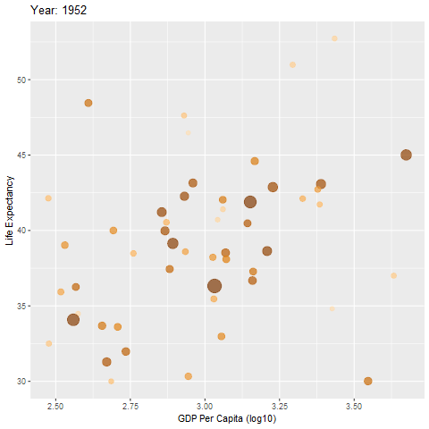

view\_follow
================
Danielle Navarro
22/11/2018

Creating the animation
----------------------

Based on the `gapminder` animation from the `gganimate` GitHub page, let's plot GDP against life expectancy for the African nations and animate them by year:

``` r
pic <- gapminder %>% filter(continent == "Africa") %>%
  ggplot(aes(
    x = log10(gdpPercap), y = lifeExp, 
    size = pop, colour = country
  )) +
  geom_point(alpha = 0.7, show.legend = FALSE) +
  scale_colour_manual(values = country_colors) +
  scale_size(range = c(2, 12)) 

anim <- pic + 
  labs(
    title = 'Year: {frame_time}', 
    x = 'GDP Per Capita (log10)', 
    y = 'Life Expectancy') +
  transition_time(year) +
  ease_aes('linear')

anim %>% animate(type = "cairo")
```


This shows a general pattern of GDP and life expectancy both rising.

Allowing the view to follow the data
------------------------------------

In some instances we may not want to fix the axes, and instead have the plot zoom in and out based on the natural scale of the data at each frame. The `view_follow()` function allows this:

``` r
anim2 <- anim + view_follow()
anim2 %>% animate(type = "cairo")
```


The `fixed_x` and `fixed_y` arguments allow us to keep one of the axes fixed while the other one zooms in and out:

``` r
anim3 <- anim + view_follow(fixed_x = TRUE)
anim3 %>% animate(type = "cairo")
```


If the plot includes shadows, the view is calculated in a way that includes the shadows:

``` r
anim4 <- anim + view_follow() + shadow_wake(.1, wrap = FALSE)
anim4 %>% animate(type = "cairo", detail= 5)
```


